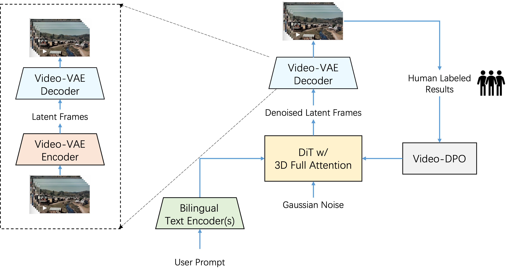
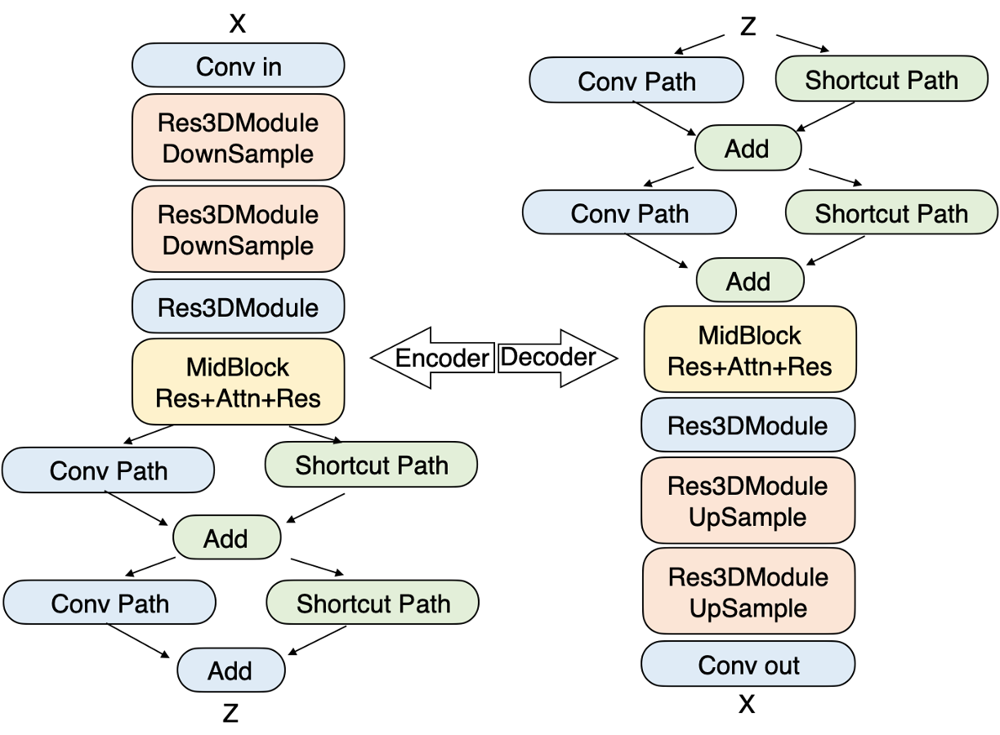
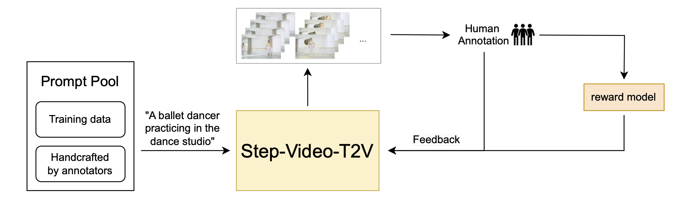

<p align="center">
  
</p>
<div align="center">
  <a href="https://yuewen.cn/videos"></a> &ensp;
  <a href="https://arxiv.org/abs/2502.10248"></a> &ensp;
  <a href="https://x.com/StepFun_ai"></a> &ensp;
</div>

<div align="center">
  <a href="https://huggingface.co/stepfun-ai/stepvideo-t2v"></a> &ensp;
  <a href="https://huggingface.co/stepfun-ai/stepvideo-t2v-turbo"></a> &ensp;
</div>

## 🔥🔥🔥 News!!
* Feb 17, 2025: 👋 We release the inference code and model weights of Step-Video-T2V. [Download](https://huggingface.co/stepfun-ai/stepvideo-t2v)
* Feb 17, 2025: 👋 We release the inference code and model weights of Step-Video-T2V-Turbo. [Download](https://huggingface.co/stepfun-ai/stepvideo-t2v-turbo)
* Feb 17, 2025: 🎉 We have made our technical report available as open source. [Read](https://arxiv.org/abs/2502.10248)

## Video Demos

<table border="0" style="width: 100%; text-align: center; margin-top: 1px;">
  <tr>
    <td><video src="https://github.com/user-attachments/assets/9274b351-595d-41fb-aba3-f58e6e91603a" width="100%" controls autoplay loop muted></video></td>
    <td><video src="https://github.com/user-attachments/assets/2f6b3ad5-e93b-436b-98bc-4701182d8652" width="100%" controls autoplay loop muted></video></td>
    <td><video src="https://github.com/user-attachments/assets/67d20ee7-ad78-4b8f-80f6-3fdb00fb52d8" width="100%" controls autoplay loop muted></video></td>
  </tr>
  <tr>
    <td><video src="https://github.com/user-attachments/assets/9abce409-105d-4a8a-ad13-104a98cc8a0b" width="100%" controls autoplay loop muted></video></td>
    <td><video src="https://github.com/user-attachments/assets/8d1e1a47-048a-49ce-85f6-9d013f2d8e89" width="100%" controls autoplay loop muted></video></td>
    <td><video src="https://github.com/user-attachments/assets/32cf4bd1-ec1f-4f77-a488-cd0284aa81bb" width="100%" controls autoplay loop muted></video></td>
  </tr>
  <tr>
    <td><video src="https://github.com/user-attachments/assets/f95a7a49-032a-44ea-a10f-553d4e5d21c6" width="100%" controls autoplay loop muted></video></td>
    <td><video src="https://github.com/user-attachments/assets/3534072e-87d9-4128-a87f-28fcb5d951e0" width="100%" controls autoplay loop muted></video></td>
    <td><video src="https://github.com/user-attachments/assets/6d893dad-556d-4527-a882-666cba3d10e9" width="100%" controls autoplay loop muted></video></td>
  </tr>

</table>

## Table of Contents

1. [Introduction](#1-introduction)
2. [Model Summary](#2-model-summary)
3. [Model Download](#3-model-download)
4. [Model Usage](#4-model-usage)
5. [Benchmark](#5-benchmark)
6. [Online Engine](#6-online-engine)
7. [Citation](#7-citation)
8. [Acknowledgement](#8-ackownledgement)

## 1. Introduction
We present **Step-Video-T2V**, a state-of-the-art (SoTA) text-to-video pre-trained model with 30 billion parameters and the capability to generate videos up to 204 frames. To enhance both training and inference efficiency, we propose a deep compression VAE for videos, achieving 16x16 spatial and 8x temporal compression ratios. Direct Preference Optimization (DPO) is applied in the final stage to further enhance the visual quality of the generated videos. Step-Video-T2V's performance is evaluated on a novel video generation benchmark, **Step-Video-T2V-Eval**, demonstrating its SoTA text-to-video quality compared to both open-source and commercial engines.

## 2. Model Summary
In Step-Video-T2V, videos are represented by a high-compression Video-VAE, achieving 16x16 spatial and 8x temporal compression ratios. User prompts are encoded using two bilingual pre-trained text encoders to handle both English and Chinese. A DiT with 3D full attention is trained using Flow Matching and is employed to denoise input noise into latent frames, with text embeddings and timesteps serving as conditioning factors. To further enhance the visual quality of the generated videos, a video-based DPO approach is applied, which effectively reduces artifacts and ensures smoother, more realistic video outputs.

<p align="center">
  
</p>

### 2.1. Video-VAE
A deep compression Variational Autoencoder (VideoVAE) is designed for video generation tasks, achieving 16x16 spatial and 8x temporal compression ratios while maintaining exceptional video reconstruction quality. This compression not only accelerates training and inference but also aligns with the diffusion process's preference for condensed representations.

<p align="center">
  
</p>

### 2.2. DiT w/ 3D Full Attention
Step-Video-T2V is built on the DiT architecture, which has 48 layers, each containing 48 attention heads, with each head’s dimension set to 128. AdaLN-Single is leveraged to incorporate the timestep condition, while QK-Norm in the self-attention mechanism is introduced to ensure training stability. Additionally, 3D RoPE is employed, playing a critical role in handling sequences of varying video lengths and resolutions.

<p align="center">
  
</p>

### 2.3. Video-DPO
In Step-Video-T2V, we incorporate human feedback through Direct Preference Optimization (DPO) to further enhance the visual quality of the generated videos. DPO leverages human preference data to fine-tune the model, ensuring that the generated content aligns more closely with human expectations. The overall DPO pipeline is shown below, highlighting its critical role in improving both the consistency and quality of the video generation process.

<p align="center">
  
</p>


## 3. Model Download
| Models   | 🤗Huggingface    |  🤖Modelscope |
|:-------:|:-------:|:-------:|
| Step-Video-T2V | [download](https://huggingface.co/stepfun-ai/stepvideo-t2v) | [download](https://www.modelscope.cn/models/stepfun-ai/stepvideo-t2v)
| Step-Video-T2V-Turbo (Inference Step Distillation) | [download](https://huggingface.co/stepfun-ai/stepvideo-t2v-turbo) | [download](https://www.modelscope.cn/models/stepfun-ai/stepvideo-t2v-turbo)


## 4. Model Usage
### 📜 4.1  Requirements

The following table shows the requirements for running Step-Video-T2V model (batch size = 1, w/o cfg distillation) to generate videos:

|     Model    |  height/width/frame |  Peak GPU Memory | 50 steps w flash-attn | 50 steps w/o flash-attn |
|:------------:|:------------:|:------------:|:------------:|:------------:|
| Step-Video-T2V   |        544px992px204f      |  77.64 GB | 743 s | 1232 s |
| Step-Video-T2V   |        544px992px136f      |  72.48 GB | 408 s | 605 s |

* An NVIDIA GPU with CUDA support is required. 
  * The model is tested on four GPUs.
  * **Recommended**: We recommend to use GPUs with 80GB of memory for better generation quality.
* Tested operating system: Linux
* The self-attention in text-encoder (step_llm) only supports CUDA capabilities sm_80 sm_86 and sm_90

### 🔧 4.2 Dependencies and Installation
- Python >= 3.10.0 (Recommend to use [Anaconda](https://www.anaconda.com/download/#linux) or [Miniconda](https://docs.conda.io/en/latest/miniconda.html))
- [PyTorch >= 2.3-cu121](https://pytorch.org/)
- [CUDA Toolkit](https://developer.nvidia.com/cuda-downloads)
- [FFmpeg](https://www.ffmpeg.org/) 
```bash
git clone https://github.com/stepfun-ai/Step-Video-T2V.git
conda create -n stepvideo python=3.10
conda activate stepvideo

cd Step-Video-T2V
pip install -e .
pip install flash-attn --no-build-isolation  ## flash-attn is optional
```

###  🚀 4.3 Inference Scripts

#### Multi-GPU Parallel Deployment

- We employed a decoupling strategy for the text encoder, VAE decoding, and DiT to optimize GPU resource utilization by DiT. As a result, a dedicated GPU is needed to handle the API services for the text encoder's embeddings and VAE decoding.
```bash
python api/call_remote_server.py --model_dir where_you_download_dir &  ## We assume you have more than 4 GPUs available. This command will return the URL for both the caption API and the VAE API. Please use the returned URL in the following command.

parallel=4  # or parallel=8
url='127.0.0.1'
model_dir=where_you_download_dir

torchrun --nproc_per_node $parallel run_parallel.py --model_dir $model_dir --vae_url $url --caption_url $url  --ulysses_degree $parallel --prompt "一名宇航员在月球上发现一块石碑，上面印有“stepfun”字样，闪闪发光" --infer_steps 50  --cfg_scale 9.0 --time_shift 13.0
```

#### Single-GPU Inference and Quantization

- The open-source project DiffSynth-Studio by ModelScope offers single-GPU inference and quantization support, which can significantly reduce the VRAM required. Please refer to [their examples](https://github.com/modelscope/DiffSynth-Studio/tree/main/examples/stepvideo) for more information.

###  🚀 4.4 Best-of-Practice Inference settings
Step-Video-T2V exhibits robust performance in inference settings, consistently generating high-fidelity and dynamic videos. However, our experiments reveal that variations in inference hyperparameters can have a substantial effect on the trade-off between video fidelity and dynamics. To achieve optimal results, we recommend the following best practices for tuning inference parameters:

| Models   | infer_steps   | cfg_scale  | time_shift | num_frames |
|:-------:|:-------:|:-------:|:-------:|:-------:|
| Step-Video-T2V | 30-50 | 9.0 |  13.0 | 204
| Step-Video-T2V-Turbo (Inference Step Distillation) | 10-15 | 5.0 | 17.0 | 204 |


## 5. Benchmark
We are releasing [Step-Video-T2V Eval](https://github.com/stepfun-ai/Step-Video-T2V/blob/main/benchmark/Step-Video-T2V-Eval) as a new benchmark, featuring 128 Chinese prompts sourced from real users. This benchmark is designed to evaluate the quality of generated videos across 11 distinct categories: Sports, Food, Scenery, Animals, Festivals, Combination Concepts, Surreal, People, 3D Animation, Cinematography, and Style.

## 6. Online Engine
The online version of Step-Video-T2V is available on [跃问视频](https://yuewen.cn/videos), where you can also explore some impressive examples.

## 7. Citation
```
@misc{ma2025stepvideot2vtechnicalreportpractice,
      title={Step-Video-T2V Technical Report: The Practice, Challenges, and Future of Video Foundation Model}, 
      author={Guoqing Ma and Haoyang Huang and Kun Yan and Liangyu Chen and Nan Duan and Shengming Yin and Changyi Wan and Ranchen Ming and Xiaoniu Song and Xing Chen and Yu Zhou and Deshan Sun and Deyu Zhou and Jian Zhou and Kaijun Tan and Kang An and Mei Chen and Wei Ji and Qiling Wu and Wen Sun and Xin Han and Yanan Wei and Zheng Ge and Aojie Li and Bin Wang and Bizhu Huang and Bo Wang and Brian Li and Changxing Miao and Chen Xu and Chenfei Wu and Chenguang Yu and Dapeng Shi and Dingyuan Hu and Enle Liu and Gang Yu and Ge Yang and Guanzhe Huang and Gulin Yan and Haiyang Feng and Hao Nie and Haonan Jia and Hanpeng Hu and Hanqi Chen and Haolong Yan and Heng Wang and Hongcheng Guo and Huilin Xiong and Huixin Xiong and Jiahao Gong and Jianchang Wu and Jiaoren Wu and Jie Wu and Jie Yang and Jiashuai Liu and Jiashuo Li and Jingyang Zhang and Junjing Guo and Junzhe Lin and Kaixiang Li and Lei Liu and Lei Xia and Liang Zhao and Liguo Tan and Liwen Huang and Liying Shi and Ming Li and Mingliang Li and Muhua Cheng and Na Wang and Qiaohui Chen and Qinglin He and Qiuyan Liang and Quan Sun and Ran Sun and Rui Wang and Shaoliang Pang and Shiliang Yang and Sitong Liu and Siqi Liu and Shuli Gao and Tiancheng Cao and Tianyu Wang and Weipeng Ming and Wenqing He and Xu Zhao and Xuelin Zhang and Xianfang Zeng and Xiaojia Liu and Xuan Yang and Yaqi Dai and Yanbo Yu and Yang Li and Yineng Deng and Yingming Wang and Yilei Wang and Yuanwei Lu and Yu Chen and Yu Luo and Yuchu Luo and Yuhe Yin and Yuheng Feng and Yuxiang Yang and Zecheng Tang and Zekai Zhang and Zidong Yang and Binxing Jiao and Jiansheng Chen and Jing Li and Shuchang Zhou and Xiangyu Zhang and Xinhao Zhang and Yibo Zhu and Heung-Yeung Shum and Daxin Jiang},
      year={2025},
      eprint={2502.10248},
      archivePrefix={arXiv},
      primaryClass={cs.CV},
      url={https://arxiv.org/abs/2502.10248}, 
}
```

## 8. Acknowledgement
- We would like to express our sincere thanks to the [xDiT](https://github.com/xdit-project/xDiT) team for their invaluable support and parallelization strategy. 
- Our code will be integrated into the official repository of [Huggingface/Diffusers](https://github.com/huggingface/diffusers).
- We thank the [FastVideo](https://github.com/hao-ai-lab/FastVideo) team for their continued collaboration and look forward to launching inference acceleration solutions together in the near future.
